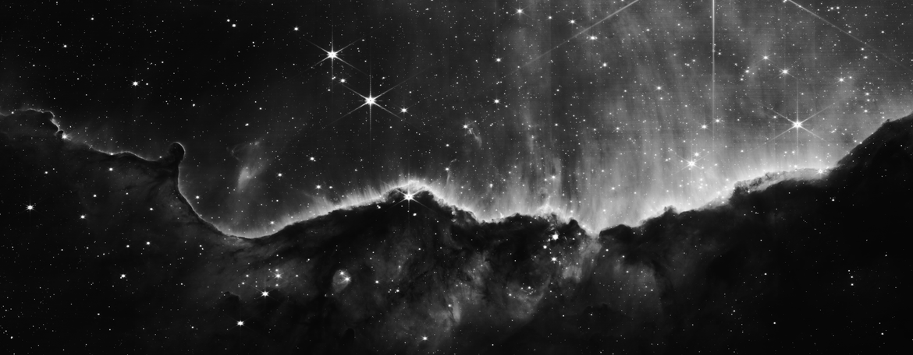

# JWST Photo Bot

Hi! This is a script designed to automatically process and post images from the James Webb Space Telescope to Twitter. It was active at [JWST Photo Bot](https://twitter.com/JWSTPhotoBot), but it is currently on an indefinite hiatus due to operating expenses.

**Update** April 18, 2025: [Yuval Harpaz](https://github.com/yuval-harpaz) has created [Astrobot JWST](https://bsky.app/profile/astrobotjwst.bsky.social) on BlueSky, carrying this project's spirit forward. Check it out!

## Update: Aug 5, 2023

As many of its followers have noticed, I sunset this bot back in March 2023. This happened for a couple reasons:
1. I didn't have the funds to keep the bot running (it needs a lot of memory).
2. The MAST database changed some of the formatting for querying the JWST, breaking the bot.
3. I was moving + busy with other life things, so I didn't have time to update it.
4. Twitter seemed like it was falling apart, and I wasn't sure I wanted to keep posting there.

I apologize for not communicating more regarding the bot's absence. I'm not able to bring it back right now, but if someone else wants to host, I'd (probably) be happy to transfer ownership of the account.

### Desktop Version

I've adapted this repo for (relatively) simple desktop use. Here are the instructions:

1. Install [Python 3](https://www.python.org/downloads/), [NumPy](https://numpy.org/install/), [AstroPy](https://docs.astropy.org/en/stable/install.html), and [Pillow](https://pypi.org/project/Pillow/).
2. Clone this repository (or download the ZIP).
3. Look through the `config.ini` file and mess with the settings (it's currently using the settings the bot had).
4. Run `image_fetcher.py` from the command line. This script queries the MAST database and puts .npy image data and .txt metadata files into a folder named `data_queue`.
5. Run `image_previewer.py` from the command line. This script routinely checks the `data_queue` folder, turns the .npy/.txt pairs into pictures, and saves the pictures to a folder titled `preview`.
6. Look at the pretty pictures in the `preview` folder!

**Warning**: These scripts may download .fits image files exceeding 50Gb in size; make sure you have that much disk space available. Additionally, RAM usage is bound to be very high -- watch out!

## Basic Q & A

### Q: What is the JWST?
A: The James Webb Space Telescope (JWST) is a space telescope that was launched from the Earth in December 2022. It keeps itself at a special spot in space (the earth-sun L2, a saddle point) 5 times further away from Earth than the Moon.

### Q: Why are the photos in black and white?
A: While most publicized images from the JWST are in full color, these color photos are always combinations of three or more separate black and white photos taken with different instruments (cameras) or filters. Right now this bot doesn't try to combine the black and white images into colored ones (though it might in the future). Also, color photos take up 3 times as much space as greyscale ones, so I'd have to to post them in lower quality, because Twitter does not let you upload photos that take up lots of memory.

### Q: Why does the bot post multiple copies of the same photo?
A: Look carefully -- the photos are probably not the same! JWST takes photos in different wavelengths of light (wavelength bands, actually). Some subjects can look very similar in different wavelengths, others not so much. For example, a red class-M star will appear brighter in the red wavelength (650nm), while a blue class-O star might appear brighter in the blue wavelength (470nm). If two photos look very similar, it just means that the distribution of light in each band is very similar. The number in the "filter" section of each post roughly indicates the wavelength (in nanometers) of light that photo is looking at. For reference, the human eye can observe wavelengths between roughly 380 and 780 nanometers.

### Q: These photos look bad / noisy / overexposed!
A: Typically, when you see images from JWST, Hubble, or any other space telescope, they have been carefully edited and fine-tuned **by hand**. JWST does not provide data in a format that can be immediately displayed on a computer monitor, and squishing it down to a computer screen without losing detail is a nontrivial task. The solution I use here is usually decent, but it has some flaws.

### Why are some of the photos so boring?
A: The JWST was made to deepen our understanding of the universe, the pretty pictures are just a bonus. Also, the JWST has a lot of calibrations it needs to do to make sure its pictures are accurate. These calibrations constitute most of the "boring" photos. I've considered naively filtering out targets with "calibration" in the title. I may do this; it's a tough call to make.

### Q: What are NIRCAM and MIRI?
A: Think of them as the JWST's different cameras. NIRCAM (Near InfraRed CAMera) captures wavelengths of light between 0.6 and 5 μm (micrometers), while MIRI (Mid InfraRed Instrument) captures longer wavelengths of light between 4.9 and 28.8 μm. The JWST has two other instruments (NIRISS and NIRSpec), but these are designed for spectroscopy, so photos made with their data are more confusing and less visually interesting at a glance.

### Q: Why did you make this?
A: While JWST's data is publicly available, it is not really accessible to the *public*. It is very difficult for a layperson with no science or programming background to download and view data from the MAST database. I thought I'd try to bridge the gap and make it easier for the average person to see a fraction of the data JWST is sending back to Earth.

## Technical Information

### MAST Database
I get my data from the [MAST Portal](https://mast.stsci.edu/portal/Mashup/Clients/Mast/Portal.html) (Barbara A. Mikulski Archive for Space Telescopes). Specifically, it asks for stage-3 calibrated public data from JWST's MIRI and NIRCAM instruments (I2D .fits files). It tries to post its photos in chronological order of time captured, but MAST isn't always updated chronologically, so out-of-order images will still appear sometimes. However, this bot will not post images that are more than 100 days old.

I use [AstroQuery](https://astroquery.readthedocs.io/en/latest/) to grab the files off of MAST.

### Image Processing
To display the data from the JWST on standard computer monitors, the .fits files need to be globally tone mapped to an 8-bit monochromatic color space. The shape and range of the value distribution can vary wildly across different JWST photos, so any trivial fixed formula won't work well. I eyeballed the following global tone mapping procedure, mostly using photos of nebulae as a reference to adjust the technique (they look the coolest). I worked under two constraints that I thought made sense: First, I didn't hard-clip any values, and second, in the spirit of posting "raw" photos, I didn't perform any local operations (no contrast enhancement / Retinex / whatever!).

First, I compute the .fits array's histograms (I use [AstroPy](https://www.astropy.org/) to load .fits files) and clip the top 0.2% and bottom 0.98% of the values. I histogram-equalize the resulting array (10,000 bins) and transform it by `f(x) = (x^4 + x^8 + x^16) / 3.0`. This essentially matches the photo's histogram to the ideal "space photo" histogram -- mostly dark, with some bright spots, and some REALLY bright spots. However, the equalization can sometimes introduce additional noise, and the power transformation can hide interesting darker parts of the image (like large gas clouds).

Second, I take the .fits array's histogram and rescale the data's (3rd percentile, 98th percentile) to the (0.0, 1.0) range. Then I apply a sigmoid function that scales things down a bit and keeps the outliers in the (0, 1) range: `f(x) = 0.5 + (2x - 2) / (2*sqrt((2x - 2)^2 + 1.0))`. This provides a nice pseudo-linear remapping that still captures the full range of the data.

I average these two values, then apply a final slight adjustment where I clamp the values to (0.0, 1.0) and expand the levels in the (0.9, 1.0) region: `f(x) = {if x <= 0.9: x*0.8/0.9, if x > 0.9: 100.0/9.0*(x - 0.9)^2 + 0.8*x/0.9}`. All of the functions are monotonic and (mostly) remap the full value range to (0.0, 1.0).  Realistically, a ton of this detail is lost when the 64 bit floating-point values are converted to bytes in the .png, but this process guarantees that no hard clipping occurs anywhere in the photo. Additionally, I don't bother gamma-correcting the levels because: 1. the sigmoid in the second step acts as a pseudo gamma correction, and 2. I am aiming for aesthetics and detail preservation, and in this case gamma correction does not help either of these factors.

I also experimented with rescaling based off of simple statistical measures (variance, median, AAD/MAD, etc.) and other sigmoid functions, but finally settled on the approach above.

There is no dithering in the bit reduction step right now. Most of the photos are noisy enough already without it. I may add some blue noise in the future, but it is not a priority.

### Image Field Descriptions
* Target: The name of the astronomical subject of the photo (UNKNOWN if there is no specific target).
* Observation Title: The reason why the photo was captured (like the title of a scientific paper).
* Observation (ra, dec): The coordinates of the photo (right ascension and declination in decimal degrees).
* Observation Start Time: The time when the whole observation began; NOT necessarily the time that the photo was taken.
* Exposure Time: The amount time that the JWST was collecting light from the sky (shutter speed).
* Instrument: Should be either NIRCAM or MIRI
* Filter: The range of wavelengths captured in the image (descriptions [here](https://jwst-docs.stsci.edu/jwst-near-infrared-camera/nircam-instrumentation/nircam-filters))
* Proposal ID: The I.D. number of the proposal that reserved the time to take this photo (can be used when querying the MAST database).
* P.I.: The principal investigator of the proposal that initiated this observation.
* ObjID: The ID number of this particular object in the MAST database.

### Downsampling
The resolutions of images from the JWST can be huge (>8k pixels across). Even with black and white images that are mostly dark, the initial converted .PNGs frequently exceed Twitter's hard 5MB/8192px media upload limits.

I use a binary search to determine the maximum photo dimensions that do not exceed 4MB (10 iterations, probably overkill). If these dimensions exceed 6144px on either axis, I set that as the new length on that axis and adjust the other dimension accordingly.

Finally, I use [PIL's](https://pillow.readthedocs.io/en/stable/) default PIL.Image.LANCZOS kernel to resample the image to the determined dimensions. This is done **after** converting the .fits data to a PNG. I also add 160px to the bottom of the image to make room for the caption.
